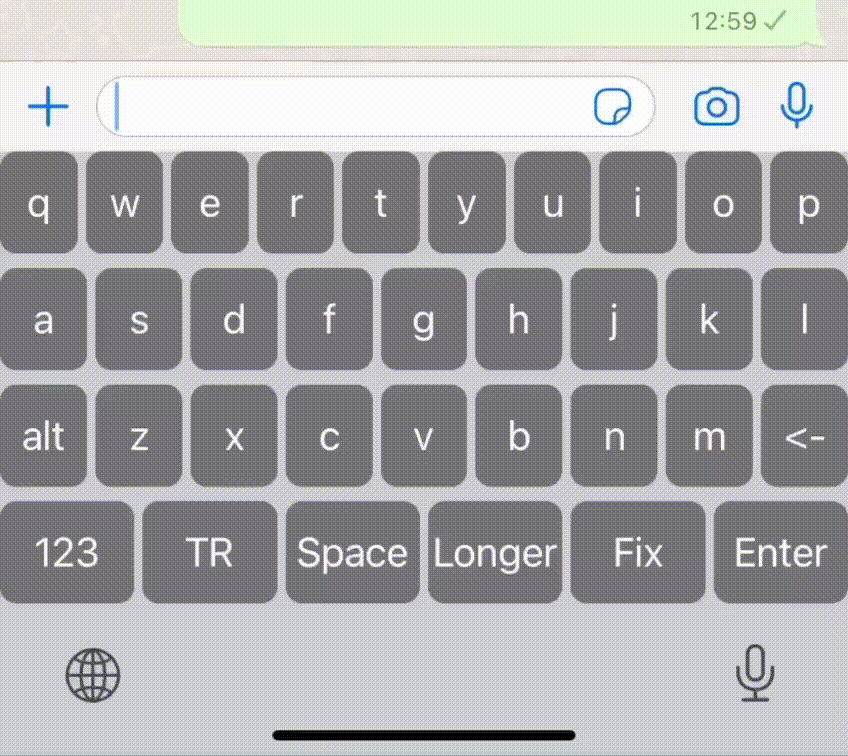

## AI-Assisted Keyboard for iOS

This is a demonstration of my proposal that keyboards could be significantly improved through the integration of AI. Let's refer to it as **Keyboard 2.0**, which offers AI assistant features.



First and foremost, this project consists of a simple iOS keyboard extension (featuring two layouts by default: English and Turkish) located in the Relax directory. Additionally, there's a straightforward API that utilizes ChatGPT to correct grammatical errors in real-time and explore other experimental functionalities, found in the `keyboard_api` directory.

### How to Run and Test 

Run the API:

```
cd keyboard_api/
python3 -m venv venv
source venv/bin/activate
pip install -r requirements.txt
uvicorn main:app --host 0.0.0.0 --port 8000
```

**NOTE**: You should to rename `.env_example` to `.env` in the `keyboard_api` directory and adjust the API_KEY to match your own OpenAI API Key. When deploying the API on your local network, ensure that you accurately specify the correct address (192.168.1.xxx) as the endpoint in `APIService.swift`.

Once the API is running, open the Relax project in Xcode and deploy it on your simulator or device to begin testing.

### Further Ideas

I believe it would be feasible to incorporate features such as `text-to-image`, where the response could be inserted into the Pasteboard for sending as a message on iOS. Additionally, there's potential to develop a new model specifically designed to rectify grammatical errors based on the source language of the given text.

### Discussion

Please feel free to share your thoughts and suggest new ideas by opening issues. Your feedback is highly appreciated.